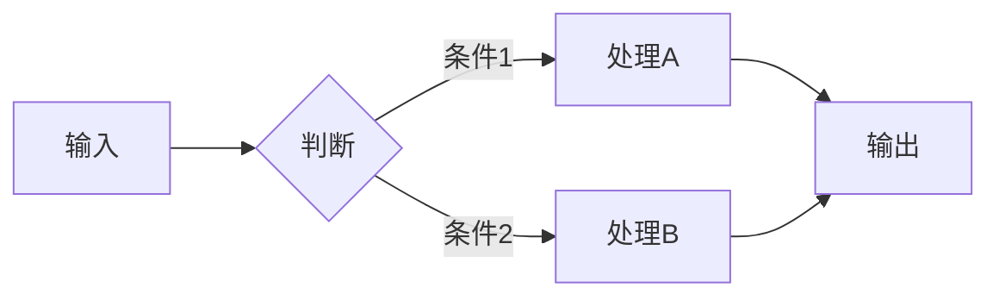

# GitHub Push Skill

将本地项目一键上传到当前 GitHub 账户的私有仓库，或对已有仓库进行改名。自动完成：检查认证 → 补全 .gitignore → 创建仓库 → 提交推送。支持全量重命名（代码引用、文档、GitHub 仓库）。

## When to Activate

- 用户说"上传到 GitHub"、"推到私有仓库"、"创建私有仓库并推送"
- 用户输入 `/github-push`
- 用户输入 `/github-push <repo-name>`
- 用户说"改项目名"、"重命名仓库"、"rename repo"
- 用户输入 `/github-push rename <new-name>`

## Commands

| Command | Action |
|---------|--------|
| `/github-push` | 使用当前目录名作为仓库名，完整推送流程 |
| `/github-push <repo-name>` | 指定仓库名，完整推送流程 |
| `/github-push rename <new-name>` | 全量重命名：代码引用 + 文档 + GitHub 仓库 + 本地目录 |

## Protocol

### Step 1: Pre-flight Checks

依次执行以下检查，任一失败则中止并提示用户修复：

```bash
# 1.1 检查是否在 git 仓库内
git rev-parse --is-inside-work-tree

# 1.2 检查 gh CLI 认证状态
gh auth status

# 1.3 检查是否已有远程仓库
git remote -v

# 1.4 检查是否存在本地私有文件（应在 .gitignore 中）
_PRIVATE_FILES=(
  "CLAUDE.md"
  "task.txt"
  "tasks.txt"
  "TODO.txt"
  "PLAN.md"
  "ARCHITECTURE.md"
  "tests/"
  "test/"
  "记录自建文件/"
  "notes/"
)
_found_private=()
for f in "${_PRIVATE_FILES[@]}"; do
  if [ -e "$f" ]; then
    # 检查是否已在 .gitignore 中
    if ! grep -q "^${f}$" .gitignore 2>/dev/null; then
      _found_private+=("$f")
    fi
  fi
done
```

**判定逻辑**：
- 如果已有 `origin` 远程仓库 → 提示用户"已有远程仓库 `origin`，是否要推送到现有仓库？" 等待确认
- 如果 `gh auth status` 失败 → 中止，提示用户运行 `gh auth login`
- 如果不在 git 仓库 → 自动执行 `git init`，无需用户手动操作（推送新项目是此 skill 的核心用途）
- 如果发现未忽略的私有文件 → 记录到待处理列表，Step 3 自动添加到 .gitignore

### Step 2: Resolve Repo Name

```
如果没有通过命令参数指定 repo-name:
  repo_name = 当前目录的文件夹名（basename）
如果通过参数指定:
  repo_name = 参数值
```

**中文/空格目录名处理**：
- 如果 `basename` 包含中文字符或空格，**不得**直接作为仓库名
- 必须提示用户指定 ASCII 仓库名：`目录名含中文（{basename}），请通过参数指定英文仓库名，如 /github-push my-repo-name`
- 收到用户指定的 ASCII 名后继续流程

向用户确认：
- 仓库名：`{repo_name}`（默认，可修改）
- 可见性：`private`（默认，可选 `public` 或 `internal`）
- 描述：基于项目内容自动生成建议，用户可修改

### Step 2.5: Directory Structure Audit（目录结构诊断）

**在暂存文件之前**，检测是否存在单层嵌套——即仓库根目录下只有一个包含源码的子目录（Python 包），而根目录本身几乎为空。这种结构会造成 `repo/{subdir}/main.py` 冗余路径。

```bash
# 找出根目录下包含 .py 文件的直接子目录
_src_subdirs=()
for d in */; do
  [ -d "$d" ] || continue
  # 跳过常见非源码目录
  case "$d" in tests/|test/|data/|workspace/|datasets/|docs/|node_modules/|.venv/|.git/) continue;; esac
  if find "$d" -maxdepth 3 -name "*.py" | grep -q .; then
    _src_subdirs+=("${d%/}")
  fi
done
```

**判定逻辑**：
- 如果 `_src_subdirs` 只有 **1 个**子目录，且根目录下的 `.py` 文件数量 = 0（即所有源码都在子目录里）→ **警告**：
  ```
  ⚠️  检测到单层嵌套：所有 Python 源码均在 {subdir}/ 子目录中，
      推送后路径为 {repo}/{subdir}/main.py，存在冗余层级。
      建议：将 {subdir}/ 内容提升到根目录，再推送。
      是否继续提升？[Y/n]
  ```
- 用户选择 Y → 执行提升（见下方提升流程），再继续 Step 3
- 用户选择 N → 记录警告，按原结构继续推送

**提升流程**（用户确认后执行）：

```bash
# 用 git mv 保留文件历史（如已 git init）
subdir="{检测到的子目录名}"
git mv "$subdir"/* .          # 提升文件
git mv "$subdir"/.[!.]* . 2>/dev/null  # 提升隐藏文件（如有）
rmdir "$subdir" 2>/dev/null   # 删除空目录

# 检查被提升的 config.py 中是否有硬编码了 subdir 层级的路径
grep -n "parent\.parent\|/$subdir/" config.py 2>/dev/null && \
  echo "⚠️  config.py 可能含有需要同步修正的路径，请检查 _ROOT 定义"
```

提升完成后提示用户检查并修正受影响的路径引用（如 `config.py` 中的 `_ROOT`、`DATA_DIR` 等）。

### Step 3: Patch .gitignore

读取当前 `.gitignore`，检查是否缺少以下常见条目。**仅追加不存在的条目，不修改已有行**：

**必须排除（安全/隐私）**：
```
.env
*.pem
*.key
credentials.json
service-account*.json
```

**必须排除（构建产物）**：
```
node_modules/
__pycache__/
*.pyc
.venv/
venv/
```

**必须排除（运行时日志）**：
```
nohup.out
output.log
*.log
```

**必须排除（IDE/OS）**：
```
.DS_Store
.idea/
.vscode/
```

**必须排除（本地/私有文件）——所有新项目默认添加**：
```
# 本地任务和笔记文件
task.txt
tasks.txt
TODO.txt
NOTES.txt

# 本地项目指导（Claude Code 专用）
CLAUDE.md
PLAN.md
ARCHITECTURE.md

# 本地测试（不推送到远程）
tests/
test/
__tests__/
*.test.js
*.test.ts
*.test.py

# 私有文档（README.md 除外）
*.md
!README.md

# 本地记录目录（常见中文命名）
记录自建文件/
notes/
私人文件/
```

**特殊处理**：
- 如果 `.venv` 是符号链接（`ls -la .venv` 显示 `->`），确保 `.gitignore` 包含 `.venv`
- 如果项目有 `data/` 目录且包含大量生成数据，建议添加 `data/0*/` 或类似模式
- **隐私优先**：如果不确定是否应推送，先添加到 `.gitignore`，用户需要时再手动移除

**自动追加逻辑**：
```bash
# 定义必须排除的条目数组（合并所有类别）
REQUIRED_IGNORES=(
  # 安全/隐私
  ".env" "*.pem" "*.key" "credentials.json" "service-account*.json"
  # 构建产物
  "node_modules/" "__pycache__/" "*.pyc" ".venv/" "venv/" "dist/" "build/"
  # 运行时日志
  "nohup.out" "output.log" "*.log"
  # IDE/OS
  ".DS_Store" ".idea/" ".vscode/" "*.swp" "*.swo" "*~"
  # 本地私有文件
  "task.txt" "tasks.txt" "TODO.txt" "NOTES.txt"
  "CLAUDE.md" "PLAN.md" "ARCHITECTURE.md"
  "记录自建文件/" "notes/" "私人文件/"
  # 测试目录
  "tests/" "test/" "__tests__/"
  # 除README外的所有markdown（放在最后确保优先级）
  "*.md" "!README.md"
)

# 创建或读取 .gitignore
touch .gitignore

# 追加缺失的条目
_added=()
for pattern in "${REQUIRED_IGNORES[@]}"; do
  if ! grep -qF "^${pattern}$" .gitignore 2>/dev/null; then
    echo "$pattern" >> .gitignore
    _added+=("$pattern")
  fi
done

# 如果添加了除 README.md 的全局排除，确保 !README.md 在它之后
if grep -q "^\*.md$" .gitignore && ! grep -q "^!README.md$" .gitignore; then
  echo "!README.md" >> .gitignore
fi

# 报告新增的条目
if [ ${#_added[@]} -gt 0 ]; then
  echo "已自动添加到 .gitignore:"
  printf '  - %s\n' "${_added[@]}"
fi
```

追加缺失条目后，如果 `.gitignore` 有变更，需 git add 它。

### Step 3.5: Corporate Information Sanitization（企业信息清洗）

**在暂存文件之前**，扫描整个项目目录，检测并清除与蚂蚁集团（Ant Group）相关的企业内部信息。此步骤为强制步骤，不可跳过。

#### 3.5.1 关键词列表

以下关键词用于匹配企业相关内容（不区分大小写）：

```bash
_CORP_KEYWORDS=(
  # 公司名称
  "蚂蚁" "蚂蚁集团" "蚂蚁金服" "Ant Group" "AntGroup" "Ant Financial"
  # 内部域名
  "antfin.com" "antgroup.com" "alipay.com" "mybank.cn"
  "antfin-inc.com" "ant-inc.com"
  # 内部平台/工具
  "yuque.antfin" "aone.alibaba" "def.alibaba" "antcode"
  "sofa" "oceanbase" "miniapp"
  # 内部邮箱后缀
  "@antfin.com" "@antgroup.com" "@alibaba-inc.com" "@alipay.com"
  # 产品/服务名（内部语境）
  "支付宝内部" "蚂蚁内部" "集团内部" "AIS" "蚂蚁MCP" "蚂蚁网关"
  "mpaas" "金融云" "蚂蚁云"
)
```

#### 3.5.2 扫描流程

```bash
# 排除目录
_SCAN_EXCLUDES=".git/ .venv/ venv/ __pycache__/ node_modules/ data/ .idea/ .pytest_cache/"

# 构建 grep 模式（用 | 连接所有关键词）
_pattern=$(printf '%s|' "${_CORP_KEYWORDS[@]}")
_pattern="${_pattern%|}"  # 去掉末尾 |

# 扫描所有文本文件
grep -rni --include="*.py" --include="*.md" --include="*.txt" \
  --include="*.json" --include="*.yml" --include="*.yaml" \
  --include="*.toml" --include="*.cfg" --include="*.ini" \
  --include="*.sh" --include="*.env.example" --include="*.html" \
  -E "$_pattern" . \
  | grep -v ".git/" | grep -v ".venv/" | grep -v "__pycache__/" \
  | grep -v "node_modules/" | grep -v ".idea/"
```

#### 3.5.3 分类处理

扫描结果按以下三类分别处理：

**类型 A：整文件为企业内容（删除）**

文件名或路径包含企业关键词，或文件内容 >50% 涉及企业信息的文件。

判定条件（满足任一即为 A 类）：
- 文件名包含"蚂蚁"、"antfin"、"antgroup"、"AIS"等关键词
- 文件内容主要描述企业内部工具/平台/接入流程
- 文件为企业内部手册、接入文档、对接指南

处理方式：
```bash
# 如果文件已被 git 追踪，从 git 中移除
git rm --cached "{file}" 2>/dev/null

# 如果文件未被追踪，直接删除或添加到 .gitignore
# 优先删除（推送前清理），若用户需要本地保留则添加到 .gitignore
rm -f "{file}"   # 默认删除
# 或: echo "{file}" >> .gitignore  # 用户选择本地保留时
```

向用户报告：
```
🗑️  已删除企业相关文件：
  - 其他文件/蚂蚁MCP网关接入手册.md（企业内部接入文档）
  - scripts/deploy_ais_internal.sh（内部部署脚本）
```

**类型 B：文件中混有企业引用（清洗）**

项目核心代码文件中包含少量企业相关的 URL、邮箱、注释、配置项。

处理方式：
```bash
# 替换企业内部 URL 为占位符
sed -i '' 's|https\?://[a-zA-Z0-9._-]*\.antfin\.com[^ ]*|https://your-internal-url|g' "{file}"
sed -i '' 's|https\?://[a-zA-Z0-9._-]*\.antgroup\.com[^ ]*|https://your-internal-url|g' "{file}"
sed -i '' 's|https\?://yuque\.antfin\.com[^ ]*|https://your-docs-url|g' "{file}"

# 替换企业邮箱为占位符
sed -i '' 's|[a-zA-Z0-9._-]*@antfin\.com|user@example.com|g' "{file}"
sed -i '' 's|[a-zA-Z0-9._-]*@antgroup\.com|user@example.com|g' "{file}"
sed -i '' 's|[a-zA-Z0-9._-]*@alibaba-inc\.com|user@example.com|g' "{file}"
sed -i '' 's|[a-zA-Z0-9._-]*@alipay\.com|user@example.com|g' "{file}"

# 删除整行为企业内部注释的行（如 # 蚂蚁内部XXX）
sed -i '' '/^[[:space:]]*#.*蚂蚁内部/d' "{file}"
sed -i '' '/^[[:space:]]*#.*集团内部/d' "{file}"
```

向用户报告每个文件的清洗详情。

**类型 C：.env / .env.example 中的企业配置（清洗或移除）**

处理方式：
```bash
# 检查 .env.example 中是否有企业内部 endpoint
grep -n "antfin\|antgroup\|alipay\|蚂蚁" .env.example 2>/dev/null

# 替换为通用占位符
sed -i '' 's|=.*antfin\.com.*|=https://your-api-endpoint|g' .env.example
sed -i '' 's|=.*antgroup\.com.*|=https://your-api-endpoint|g' .env.example
```

#### 3.5.4 Git 历史中的企业信息

如果企业相关文件**已经在之前的 commit 中被推送过**：

```bash
# 检查 git 历史中是否追踪过企业文件
git log --all --diff-filter=A --name-only --pretty=format: -- "*蚂蚁*" "*antfin*" "*AIS*" 2>/dev/null | sort -u
```

处理策略：
- 如果仅在最近 1-2 个未推送的 commit 中 → 用 `git rm --cached` 移除并在新 commit 中清理
- 如果已推送到远程 → **警告用户**：历史中存在企业信息，建议使用 `git filter-repo` 清理历史（提供命令但不自动执行，需用户确认）
- 警告文本：
  ```
  ⚠️  以下企业相关文件存在于 git 历史中（已推送到远程）：
    - {file_list}
  建议使用 git filter-repo 清理历史，但此操作会重写 commit，需 force-push。
  是否执行历史清理？[y/N]
  ```

#### 3.5.5 验证

清洗完成后，重新扫描确认无残留：

```bash
# 最终验证：项目中不应有任何企业关键词
grep -rni -E "$_pattern" . \
  | grep -v ".git/" | grep -v ".venv/" | grep -v "__pycache__/" \
  | grep -v "node_modules/" | grep -v ".idea/"
```

如果仍有残留，逐一处理后重新验证，直到通过。

#### 3.5.6 向用户报告

```
🔒 企业信息清洗完成

已删除文件: {delete_count} 个
  - {file1}（原因）
  - {file2}（原因）

已清洗文件: {sanitize_count} 个
  - {file3}: 替换了 {n} 处企业 URL / 邮箱
  - {file4}: 移除了 {m} 行企业内部注释

历史风险: {yes/no}
  {如有历史风险，展示具体文件和建议操作}

验证结果: ✅ 无企业信息残留
```

### Step 4: Stage & Review

```bash
# 暂存所有文件
git add -A

# 检查是否有符号链接被误暂存
git status -s | grep "^A" | while read line; do
  file=$(echo "$line" | awk '{print $2}')
  if [ -L "$file" ]; then
    echo "WARNING: symlink staged: $file"
  fi
done

# 查看暂存概况
git status -s
```

**符号链接处理**：
- 如果发现 `.venv` 等符号链接被暂存 → `git reset HEAD <symlink>` 并添加到 `.gitignore`
- 其他符号链接 → 提示用户确认是否应排除

### Step 5: Create GitHub Repo

```bash
gh repo create {repo_name} --{visibility} --source=. --description "{description}"
```

- `visibility` 默认 `private`
- `--source=.` 会自动添加 remote origin
- 如果仓库已存在同名 → 提示用户选择：换名 / 推送到已有仓库 / 中止

### Step 6: Commit

```bash
git commit -m "feat: 初始化仓库，推送项目文件

- 项目完整代码与配置
- .gitignore 安全规则补全"
```

**commit message 规则**：
- 禁止包含任何 `Co-Authored-By` 署名
- 使用 conventional commits 格式
- 首次推送用 `feat: 初始化仓库`
- 后续推送根据实际变更类型选择 `feat/fix/docs/refactor` 等

### Step 7: Push

```bash
git push -u origin main
```

如果默认分支不是 `main`（如 `master`），使用实际分支名：
```bash
current_branch=$(git branch --show-current)
git push -u origin $current_branch
```

### Step 8: Verify & Report

```bash
# 验证远程仓库
gh repo view {repo_name} --json url,isPrivate

# 验证推送成功
git log --oneline -3
git status
```

向用户报告：
```
✅ 推送完成

仓库: https://github.com/{username}/{repo_name}
可见性: private
分支: main
提交: {commit_count} 个文件
```

---

## Project Positioning Protocol（项目定位协议）

**推送或重命名时，必须先分析项目再撰写 README 标题、仓库描述和项目简介。**

### 核心原则：根据项目类型选择描述风格

不同项目适合不同的表达方式。强制用一种"引擎/管线/蒸馏"风格套在所有项目上，反而会让描述失去辨识度。根据项目规模和性质，从以下四种风格中选择最合适的一种：

| 风格 | 适合场景 | 特点 |
|------|---------|------|
| **简洁型** | 小工具、单功能脚本、CLI | 直接说清做什么，不过度包装 |
| **技术型** | 框架、库、SDK、中间件 | 强调技术机制、接口设计、架构决策 |
| **产品型** | 应用、服务、平台 | 强调用户价值、使用场景、解决什么问题 |
| **管线型** | 数据管道、训练流程、ETL | 强调数据流、处理阶段、输入输出格式 |

**关键判断**：如果一个项目本质就是一个小脚本，用简洁型；如果是一个需要别人集成使用的库，用技术型；如果是面向终端用户的应用，用产品型；如果是一连串自动化步骤的处理流程，用管线型。

### 风格模板与示例

#### 简洁型

标题：直接的功能陈述
```
# repo-name — {一句话功能说明}
```

描述公式：
```
{核心动作} {目标对象}，支持 {关键特性1} 和 {关键特性2}
```

示例：
```
# csv-merge — 按列名智能合并多个 CSV 文件

批量合并多个 CSV，自动对齐列名、处理编码差异、输出去重后的汇总表。
```

#### 技术型

标题：技术定位 + 关键机制
```
# repo-name — {技术类别}：{核心机制/设计决策}
```

描述公式：
```
{技术类别} for {目标语言/平台} — {核心设计决策}，支持 {关键特性}
```

示例：
```
# async-cache — 异步缓存中间件：基于 TTL 的分层回退策略

为 asyncio 应用设计的缓存抽象层，支持内存 → Redis → 源端三级回退，
自动处理竞态条件和级联失效。
```

#### 产品型

标题：用户价值 + 核心场景
```
# repo-name — {目标用户} 的 {场景} 解决方案
```

描述公式：
```
帮助 {目标用户} {解决什么问题}，通过 {核心方法}
```

示例：
```
# invoice-parser — 财务团队的 PDF 发票自动录入工具

从扫描版 PDF 提取结构化发票数据，直接导入 ERP 系统，
减少手动录入时间和错误率。
```

#### 管线型

标题：领域 + 数据流定位
```
# repo-name — {领域} {管线类型}：{关键阶段}
```

描述公式：
```
{领域} {管线类型} — {阶段1} → {阶段2} → {阶段3}，产出 {输出物}
```

示例：
```
# finforge — 金融垂域语料合成管线：蒸馏 → 质控 → 迭代

从考点提纲出发，经教师模型蒸馏、多维度纯度验证、多轮自优化迭代，
产出可直接用于微调的高纯度种子数据集。
```

### README 撰写要求

根据所选风格，README 按以下结构组织：

#### 1. 标题行

`# ProjectName — {按所选风格的标题模板}`

标题直接反映项目本质，不刻意包装也不过度谦虚。

#### 2. 一句话定位（标题下方第一段）

用 2-3 句话说明：
- **这是什么**（按所选风格的定位）
- **为什么值得用**（比同类方案好在哪里，或解决了什么特定问题）
- **谁应该用**（目标用户或下游消费方）

#### 3. "为什么需要"段落

回答项目存在的技术或业务理由。根据风格选择侧重点：
- **简洁型**：现有工具哪里不方便，这个小工具填补了哪个空白
- **技术型**：技术选型背后的权衡，为什么选择这种架构
- **产品型**：用户当前的痛点，不用这个会怎样
- **管线型**：数据质量问题、流程断点、规模化瓶颈

#### 4. 架构/流程图

按 README Visual Enhancement 规范（见下文）绘制。形式根据项目复杂度选择：
- 简单项目：文字描述即可，不必强画流程图
- 有明确阶段的项目：用 `<pre>` 文本图或 Mermaid（如果确定主要在亮色主题下浏览）
- 复杂架构：建议生成 HTML 可视化文件（skill 可辅助生成）

#### 5. 核心机制/使用方式

- **技术型**：API 设计思路、关键抽象、扩展点
- **产品型**：核心功能、使用场景、快速开始
- **管线型**：数据流说明、每个阶段的技术动机、输出格式
- **简洁型**：安装方式、命令行用法、参数说明

#### 6. 产出物说明（管线型项目必须）

明确数据结构、输出格式、下游使用方式。

### 仓库描述（--description）格式

仓库描述不是 README 的缩略版，而是搜索结果中的"一句话广告"。按所选风格撰写：

```bash
# 简洁型
gh repo edit --description "{一句话功能说明}"

# 技术型
gh repo edit --description "{技术类别} — {核心机制}"

# 产品型
gh repo edit --description "{解决什么问题} for {目标用户}"

# 管线型
gh repo edit --description "{领域} {管线类型} — {关键阶段 × 连接符}"
```

描述中避免出现以下空洞修饰词（除非有具体指标支撑）：
- "智能的"（什么指标证明智能？）
- "高效的"（和什么比？快多少？）
- "全自动的"（哪个环节还需要人工介入？）
- "基于 AI 的"（具体用了什么模型/算法？）

### 重命名时的 README 同步

执行 `/github-push rename` 时，按以下清单同步更新：

1. **重写 README 标题**——根据新名称的语义重新选择合适的风格模板
2. **更新 CLI/入口描述**——`argparse.ArgumentParser(description=...)` 或 `__doc__` 中的项目简介
3. **更新所有 docstring/注释中的项目名**——搜索第一条 docstring 或模块注释中的定位句
4. **更新 GitHub 仓库描述**——按上述格式重新撰写
5. **如果在代码中有硬编码的项目定位**，同步更新（如 `config.py` 中的 `PROJECT_DESCRIPTION`）

---

## Rename Protocol

当用户执行 `/github-push rename <new-name>` 时，执行全量重命名流程。

### Step R1: 确定旧名和新名

```
old_name = 当前 Python 包名 / 项目名（从代码中推断）
new_name = 用户指定的 new-name
```

**推断旧名的方法**（按优先级）：
1. 目录中包含 `__init__.py` 的包目录名
2. Python 文件中 `from xxx import` 的最常见包名前缀
3. 当前目录的 `basename`

**向用户确认**：
- 旧名：`{old_name}`（自动检测，可修改）
- 新名：`{new_name}`
- 重命名范围：代码引用 + 文档 + 定位措辞 + GitHub 仓库 + 本地目录

### Step R2: 影响分析

搜索所有受影响的文件和引用点：

```bash
# 搜索代码和文档中的旧名引用
grep -rn "{old_name}" --include="*.py" --include="*.md" --include="*.txt" \
  --include="*.json" --include="*.yml" --include="*.yaml" .
```

**分类统计**：
1. **Python import 语句**：`from {old_name}.xxx import`
2. **Python docstring / 注释**：文档字符串中的项目名
3. **CLI 描述**：`argparse.ArgumentParser(description=...)`
4. **Markdown 文档**：README、CLAUDE.md 等
5. **文件名**：包含旧名的文件（如 `INFRASTRUCTURE_PATTERNS({old_name}).md`）
6. **配置文件**：`.env` 中的注释、`requirements.txt` 等

**排除**：
- `data/` 目录下的运行时输出文件（评估报告等）—— 这些是历史数据，不应修改
- `.git/` 目录
- `.venv/` 目录

向用户展示影响范围，确认后继续。

### Step R3: 执行重命名

按照以下顺序执行，确保每步可回退：

**3.1 替换 Python 源文件中的引用**

```bash
# 批量替换（适用于所有 .py 文件）
find . -name "*.py" -not -path "./.venv/*" -not -path "./.git/*" \
  -exec sed -i '' 's/{old_name}/{new_name}/g' {} +
```

**3.2 替换文档中的引用**

```bash
# Markdown 和其他文本文件
sed -i '' 's/{old_name}/{new_name}/g' README.md CLAUDE.md PLAN.md
```

**3.3 执行定位迁移**

按照 **Project Positioning Protocol** 中的"重命名时的定位迁移"清单执行：
- 重写 README 标题和一句话定位
- 更新 CLI description
- 更新所有 docstring 中的项目定位句
- 更新 GitHub 仓库描述
- 搜索并替换措辞降级词汇

**3.4 重命名文件**

```bash
# 重命名包含旧名的文件
mv "INFRASTRUCTURE_PATTERNS({old_name}).md" "INFRASTRUCTURE_PATTERNS({new_name}).md"
# 以及其他包含旧名的文件
```

**3.5 替换文件内部引用**

对重命名的文件，更新其内部的旧名引用：

```bash
sed -i '' 's/{old_name}/{new_name}/g' "INFRASTRUCTURE_PATTERNS({new_name}).md"
```

### Step R4: 验证替换

```bash
# 验证源码和文档中无残留引用（排除 data/ 目录）
grep -rn "{old_name}" --include="*.py" --include="*.md" --include="*.txt" . \
  | grep -v ".git/" | grep -v ".venv/" | grep -v "data/"
```

如果发现残留引用，逐一修复。

### Step R5: 重命名 GitHub 仓库

```bash
# 使用 gh CLI 重命名
gh repo rename {new_name} --yes
```

**重命名后**：
- GitHub 会自动设置从旧名到新名的重定向（持续一段时间）
- 需要更新本地 remote URL，**必须先检测当前协议，保持一致**：

```bash
# 检测当前 remote URL 协议（SSH 或 HTTPS），不能硬编码
_current_url=$(git remote get-url origin 2>/dev/null || echo "")
if [[ "$_current_url" == git@* ]]; then
  git remote set-url origin "git@github.com:{username}/{new_name}.git"
else
  git remote set-url origin "https://github.com/{username}/{new_name}.git"
fi

# 验证新 URL 可达
git ls-remote --exit-code origin HEAD > /dev/null 2>&1 || \
  echo "⚠️  remote URL 验证失败，请手动检查: git remote -v"
```

同时更新仓库描述（按 Project Positioning Protocol 格式）：

```bash
gh repo edit {new_name} --description "[领域] + [技术本质] — [核心机制]"
```

### Step R6: 提交并推送

```bash
git add -A
git commit -m "refactor: rename project from {old_name} to {new_name}

- Package: {old_name} → {new_name}
- CLI: python -m {new_name}.cli
- Branding: {新定位公式}
- GitHub repo: {username}/{new_name}"
git push -u origin {branch}
```

### Step R7: 报告

向用户报告：
```
✅ 重命名完成

包名: {old_name} → {new_name}
仓库: https://github.com/{username}/{new_name}
描述: [新定位公式]
变更文件: {count} 个
替换引用: {old_name} → {new_name}（代码 + 文档 + 定位措辞 + 文件名）
```

---

## Error Handling

| 错误 | 处理方式 |
|------|----------|
| `gh auth status` 失败 | 中止，提示 `gh auth login` |
| 不在 git 仓库 | 自动执行 `git init`，继续流程 |
| 仓库同名已存在 | 询问用户：换名 / 推送到已有 / 中止 |
| `.gitignore` 缺少安全规则 | 自动补全，告知用户追加了哪些条目 |
| 符号链接被暂存 | 自动 unstage 并添加到 .gitignore |
| push 被拒绝（remote 有更新） | 提示用户先 `git pull --rebase` |
| 目录名含中文/空格 | 要求用户通过参数指定 ASCII 仓库名 |
| SSH 协议不可用 | 切换 HTTPS：`gh config set git_protocol https` |
| 重命名后 remote URL 失效 | 检测当前协议（SSH/HTTPS），用同协议重设 URL |
| grep 发现残留引用 | 逐一修复后重新验证 |
| `gh repo rename` 失败 | 检查仓库权限，可能需要手动在 GitHub 网页重命名 |
| 企业信息扫描发现残留 | 逐一清洗后重新验证，直到扫描通过 |
| 企业文件已存在于 git 历史 | 警告用户，提供 `git filter-repo` 命令但不自动执行 |
| 企业 URL 嵌在代码逻辑中（非注释） | 替换为占位符后提示用户检查功能是否受影响 |

## Anti-Patterns

- **禁止**在 `.gitignore` 未补全安全规则的情况下推送
- **禁止**推送包含 `.env`、API key、密码等敏感文件的提交
- **禁止** force-push 到已有远程仓库
- **禁止**自动修改用户已有的 `.gitignore` 规则（只追加不修改）
- **禁止** commit message 包含 AI 署名（Co-Authored-By）
- **禁止**修改 `data/` 目录下的运行时输出文件（历史数据不应被重命名影响）
- **禁止**跳过验证步骤直接推送（重命名后必须 grep 确认无残留引用）
- **禁止**强制所有项目套用统一的"引擎/管线/蒸馏"风格——应根据项目类型选择简洁型、技术型、产品型或管线型
- **禁止**在仓库描述中使用无具体指标支撑的空洞修饰词（"智能""高效""全自动"）
- **禁止**推送 CLAUDE.md、task.txt、tests/、记录自建文件/ 等本地私有文件
- **禁止**推送除 README.md 外的其他 Markdown 文件（如 PLAN.md、ARCHITECTURE.md、INFRASTRUCTURE_PATTERNS.md 等）
- **禁止**直接使用中文或含空格的目录名作为 GitHub 仓库名（必须要求用户指定 ASCII 名）
- **禁止**在 Step 2.5 诊断出单层嵌套后跳过警告直接推送（必须告知用户并等待确认）
- **禁止**重命名后硬编码 SSH 或 HTTPS 协议重设 remote URL（必须检测当前协议后保持一致）
- **禁止**推送包含蚂蚁集团（Ant Group）企业内部信息的文件——包括内部手册、内部 URL（`*.antfin.com`、`*.antgroup.com`）、内部邮箱（`@antfin.com`）、内部工具名称等
- **禁止**跳过 Step 3.5 企业信息清洗步骤直接进入暂存
- **禁止**在未完成企业信息验证扫描的情况下执行 commit 和 push

## README Visual Enhancement（可视化增强）

README 的视觉层次直接影响第一印象。通过 badges、banner、流程图和徽章系统，让项目在一众纯文本 README 中脱颖而出。

### Badges / Shields

README 顶部应在标题下方放置一行 badges，使用 [shields.io](https://shields.io) 动态生成。

**推荐徽章组合**

| 徽章 | URL 模板 | 适用条件 |
|------|----------|----------|
| **Language** | `https://img.shields.io/badge/Python-3.11-blue` | 所有项目，标明主语言版本 |
| **License** | `https://img.shields.io/github/license/{user}/{repo}` | 有 LICENSE 文件时 |
| **Last Commit** | `https://img.shields.io/github/last-commit/{user}/{repo}` | 活跃项目 |
| **Repo Size** | `https://img.shields.io/github/repo-size/{user}/{repo}` | 体积敏感项目 |
| **PyPI** | `https://img.shields.io/pypi/v/{package}` | 已发布到 PyPI 时 |
| **CI Status** | `https://img.shields.io/github/actions/workflow/status/{user}/{repo}/ci.yml` | 有 GitHub Actions 时 |
| **Code Style** | `https://img.shields.io/badge/style-black-000000` | 使用 black/ruff 等 |

**badge 行格式**：

```markdown
<p align="center">
  
  
  
</p>
```

**规则**：
1. 最多 4-5 个徽章，过多会造成视觉噪音
2. 将最重要、最独特的前置，通用徽章（如 language）后置
3. 使用 `align="center"` 让徽章行居中
4. 如果项目无 PyPI 发布、无 CI、无 LICENSE，不要硬凑徽章

### Banner / Header 区

README 顶部可以设计一个视觉 header 区，提升辨识度。

**方案 A：纯文本 Banner（推荐，零依赖）**

```markdown
<div align="center">

# ProjectName

**{一句话副标题}**

<p align="center">
  
</p>

</div>

---
```

**方案 B：ASCII Art Banner（适合 CLI 工具）**

如果项目是 CLI 工具，在 README 顶部放置一个由字符构成的 Logo banner：

```markdown
<pre align="center">
╔═══════════════════════════════════╗
║  ██╗  ██╗██████╗ ██╗    ██████╗   ║
║  ██║  ██║╚════██╗██║    ╚════██╗  ║
║  ███████║ █████╔╝██║     █████╔╝  ║
║  ██╔══██║██╔═══╝ ██║     ╚═══██╗  ║
║  ██║  ██║███████╗███████╗██████╔╝  ║
║  ╚═╝  ╚═╝╚══════╝╚══════╝╚═════╝   ║
╚═══════════════════════════════════╝
</pre>
```

使用 [figlet](http://www.figlet.org/) 生成，选择 `slant`、`big`、`standard` 等字体。

**方案 C：Social Preview 图片（最佳视觉效果）**

GitHub 仓库支持设置一张 1280×640 的 Social Preview 图片，在分享仓库链接时展示。技能可以辅助生成：

推送完成后，如果用户需要，运行 bundled 脚本生成预览 HTML：

```bash
python ${CLAUDE_SKILL_DIR}/scripts/generate_social_preview.py "ProjectName" "一句话副标题" Python CLI MIT
```

这会在项目 `docs/social-preview.html` 生成一个自包含的 HTML 页面。用户用浏览器打开（100% 缩放），截图 1280×640 区域，上传到 GitHub Settings → Social preview。

### 流程图规范

README 中的流程图应根据复杂度和目标读者选择合适的形式。

**选项 1：文字描述（适合简单项目）**

对于步骤简单的流程，直接用有序列表说明，不需要流程图：

```markdown
处理流程：
1. 读取配置 → 2. 验证输入 → 3. 执行转换 → 4. 输出结果
```

**选项 2：`<pre>` + Unicode 框线（适合中等复杂度）**

用 HTML `<pre>` 包裹纯文本流程图，兼容任意 GitHub 主题：

```html
<pre>
<b>输入</b>
    │
    ▼
╔════════════════════════════╗
║  <b>阶段名称</b>                  ║
║  ├─ 维度1: 值1 / 值2        ║
║  └─ 维度2: 值a / 值b        ║
╚════════════════════════════╝
    │
    ▼ <b>输出文件</b>
    │
  ┌─ 条件A? ──是──→ <b>结果A</b>
  └─ 条件B? ──是──→ <b>结果B</b>
</pre>
```

| 符号 | 用途 |
|------|------|
| `╔═╗ ╚═╝` | 阶段容器（双线框） |
| `┌─┐ └─┘` | 条件/分支框（单线框） |
| `│ ▼ ►` | 流向 |
| `├─ └─` | 树形展开 |
| `──→` | 条件分支指向结果 |

规则：
- 核心节点加粗（`<b>`）
- 普通文字不加粗
- 对齐：英文用空格，中文可用全角字符
- 容器内缩进 2 空格

**选项 3：Mermaid（仅在亮色主题为主时使用）**

如果目标用户主要在亮色主题下浏览，可使用 Mermaid：

```markdown

```

注意：Mermaid 在深色主题下文字可能不可读。如果 README 面向不确定的读者群，优先使用 `<pre>` 方案。

### 文件结构树

展示项目结构时，使用树形符号增强可读性：

```markdown
```text
repo-name/
├── src/
│   ├── core/
│   │   ├── engine.py          # 核心处理引擎
│   │   └── pipeline.py        # 数据管线编排
│   ├── io/
│   │   ├── reader.py          # 多格式输入解析
│   │   └── writer.py          # 结构化输出序列化
│   └── cli.py                 # 命令行入口
├── tests/
├── resources/
│   └── prompts/               # LLM prompt 模板
├── pyproject.toml
└── README.md
```
```

使用缩进和注释说明每个目录的用途，避免只是一个干巴巴的 tree。

### 状态指示器

在技术文档中，用 emoji 或符号标记组件状态：

```markdown
| 组件 | 状态 | 说明 |
|------|------|------|
| 输入解析 | ✅ 稳定 | 支持 CSV / JSON / Parquet |
| 核心引擎 | ⚡ 实验性 | API 可能变动 |
| 输出序列化 | 🚧 开发中 | 仅支持 JSON 目前 |
```

可选的指示符：
- ✅ 稳定 / 🚧 开发中 / ⚡ 实验性 / ❌ 已弃用
- 🟢 高性能 / 🟡 中等 / 🔴 需优化

## Python 项目目录结构规范

新建 Python 项目或重构现有项目时，遵循以下标准目录结构（参考 FinSight 模式）：

### 标准结构

```
project_name/                  # 项目根目录（与仓库名一致）
├── src/package_name/          # 源代码目录（必须放在 src/ 下，避免父子重名）
│   ├── __init__.py
│   ├── __main__.py            # 支持 python -m package_name
│   ├── cli.py                 # CLI 入口
│   ├── config.py              # 配置管理
│   └── ...                    # 其他模块
├── tests/                     # 测试目录（与 src/ 同级）
│   ├── __init__.py
│   └── test_*.py
├── resources/                 # 资源文件（提示词、模板等）
│   ├── prompts/
│   └── templates/
├── datasets/                  # 用户数据集（输入/输出）
├── workspace/                 # 运行时工作目录（日志、备份、临时文件）
├── docs/                      # 文档目录
├── pyproject.toml            # 现代 Python 包配置
├── requirements.txt          # 依赖列表
├── .env                      # 环境变量（已加入 .gitignore）
├── .env.example              # 环境变量示例
├── .gitignore
└── README.md
```

### 关键原则

| 原则 | 说明 | 示例 |
|------|------|------|
| **src/ 布局** | Python 包必须放在 `src/` 下 | `src/finforge/` 而非 `finforge/finforge/` |
| **避免父子重名** | 包目录与项目根目录禁止同名 | 错误：`myapp/myapp/` 正确：`myapp/src/myapp/` |
| **数据集分离** | 用户数据与运行时数据分离 | `datasets/`（用户数据）+ `workspace/`（运行时） |
| **资源独立** | 提示词、模板放入 `resources/` | `resources/prompts/` |
| **测试同级** | `tests/` 与 `src/` 同级 | 便于 pytest 发现和运行 |

### 路径管理

在 `config.py` 中统一定义路径：

```python
from pathlib import Path

# 项目根目录（从 src/package/ 上两级）
PROJECT_ROOT = Path(__file__).parent.parent.parent

# 标准子目录
DATASETS_DIR = PROJECT_ROOT / "datasets"
WORKSPACE_DIR = PROJECT_ROOT / "workspace"
RESOURCES_DIR = PROJECT_ROOT / "resources"
PROMPTS_DIR = RESOURCES_DIR / "prompts"
```

### pyproject.toml 最小配置

```toml
[build-system]
requires = ["setuptools>=61.0", "wheel"]
build-backend = "setuptools.build_meta"

[project]
name = "package_name"
version = "0.1.0"
description = "项目描述"
readme = "README.md"
requires-python = ">=3.10"
dependencies = [
    "openai>=1.0.0",
    "python-dotenv>=1.0.0",
]

[project.scripts]
package_name = "package_name.cli:main"

[tool.setuptools.packages.find]
where = ["src"]
```

### 推送前检查清单

- [ ] 源代码位于 `src/` 下，非项目根目录
- [ ] 无父子文件夹重名（如 `foo/foo/`）
- [ ] `tests/` 与 `src/` 同级
- [ ] 数据集分离为用户数据和运行时数据
- [ ] 存在 `pyproject.toml` 或 `setup.py`
- [ ] `.gitignore` 包含 `.env`、`__pycache__/`、`.venv/`、`workspace/`、`datasets/`

---

## Best Practices

- 推送前始终检查符号链接，避免将外部目录内容推入仓库
- **推送前检查本地私有文件**：CLAUDE.md、task.txt、tests/、记录自建文件/ 等不应推送到远程
- **默认排除除 README.md 外的所有 Markdown 文件**：PLAN.md、ARCHITECTURE.md、INFRASTRUCTURE_PATTERNS.md 等属于本地工作文件
- 描述字段根据项目内容自动生成，但让用户确认
- 首次推送后建议用户在 GitHub 上检查文件列表，确认无敏感信息泄露
- 如果项目有 `.env.example`，推送后提醒用户补充环境变量说明
- 重命名后验证所有引用点已更新，特别关注 Python import 语句和 CLI 入口
- 重命名后提醒用户更新其他可能引用旧名的地方（如 CI/CD 配置、Docker compose、部署脚本等）
- 撰写 README 时执行 Project Positioning Protocol，根据项目类型（简洁/技术/产品/管线）选择合适风格，避免所有项目套用同一套措辞
- 如果用户需要，在推送完成后运行 `scripts/generate_social_preview.py` 生成 Social Preview 辅助图
- **推送前必须执行 Step 3.5 企业信息清洗**：扫描蚂蚁集团相关关键词，删除企业内部文档，清洗代码中的内部 URL/邮箱/工具名
- 企业信息清洗后必须重新验证扫描通过，未通过验证前禁止进入 Stage 步骤
- 如果 git 历史中存在企业文件，警告用户并提供清理建议（`git filter-repo`），但不自动执行 force-push